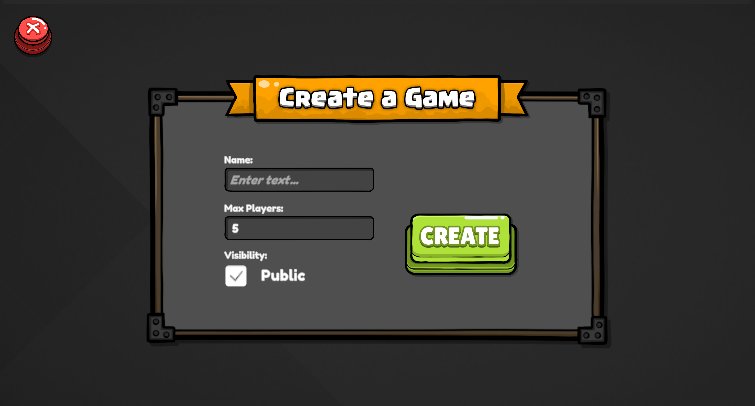

# Netcode for GameObjects Demo

This project is a basic implementation of how NetCode functions in Unity, along with instructions on how to connect to both public and private lobby systems and construct a lobby.

---

### Visual Representation

1. Create and Join Lobby.
    
    1. There are 2 lobby creation types public and private
        
        
    2. Join public Lobby by click on the lobby name popup in Lobby panel
       
    3. Join Private Lobby by provide lobby code and password.
        
2. Waiting in room for PlayArea.
    
3. Once both player join the demo game starts
    

---
### Character Move

Use ``W`` ``S`` ``A`` ``D`` or ``UP`` ``DOWN`` ``LEFT`` ``RIGHT`` arrow key to move player in forward, backward, left and right Direction.

---
### Video ShowCase

1. Game Play with public Lobby [public Lobby Game Play](./Asset/vid/1.mp4)
2. Game Play with private Lobby [private Lobby Game Play](./Asset/vid/2.mp4)

----

### Build File

Here you can Download the Pc Build File [Pc Build File](./Asset/Build.zip)
